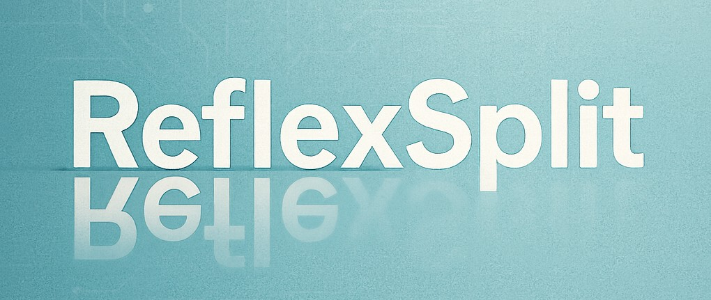

<p align="center">
  
</p>

# 🪞ReflexSplit: Single Image Reflection Separation via Layer Fusion-Separation (✨CVPR 2026✨)

<div align="center">

<!-- Badges row -->
<p>
  <a href="https://wuw2135.github.io/ReflexSplit-ProjectPage/">
    
  </a>
  <a href="https://www.arxiv.org/pdf/2601.17468">
    
  </a>
  <a href="https://pytorch.org/">
    
  </a>
  <a href="https://www.python.org/">
    
  </a>
  <a href="https://pytorch.org/">
    =2.0-%237732a8?logo=PyTorch&color=EE4C2C" />
  </a>
</p>

<!-- Authors -->
<p style="font-size: 15px;">
  <a href="https://ming053l.github.io/">Chia-Ming Lee</a>,
  <a href="https://vanlinlin.github.io/">Yu-Fan Lin</a>,
  <a href="https://github.com/wuw2135">Jin-Hui Jiang</a>,
  <a href="https://github.com/yujouhsiao">Yu-Jou Hsiao</a>,
  <a href="https://cchsu.info/">Chih-Chung Hsu</a>,
  <a href="https://yulunalexliu.github.io/">Yu-Lun Liu</a>
</p>

</div>


### Framework
<p align="center">
  
</p>

### Layer Fusion-Separation Block (LFSB) 
<p align="center">
  
</p>

<details style="font-size: 15px;">
<summary>Abstract</summary> 
Single Image Reflection Separation (SIRS) disentangles mixed images into transmission and reflection layers. Existing methods suffer from transmission-reflection confusion under nonlinear mixing, particularly in deep decoder layers, due to implicit fusion mechanisms and inadequate multi-scale coordination. We propose ReflexSplit, a dual-stream framework with three key innovations. (1) Cross scale Gated Fusion (CrGF) adaptively aggregates semantic priors, texture details, and decoder context across hier archical depths, stabilizing gradient flow and maintaining feature consistency. (2) Layer Fusion-Separation Blocks (LFSB) alternate between fusion for shared structure extraction and differential separation for layer-specific disentanglement. Inspired by Differential Transformer, we extend attention cancellation to dual-stream separation via cross-stream subtraction. (3) Curriculum training progressively strengthens differential separation through depth dependent initialization and epoch-wise warmup. Extensive experiments on synthetic and real-world benchmarks demonstrate state-of-the-art performance with superior perceptual quality and robust generalization.
</details>

## 🏞️Environment
coming soon...

## 🗂️Data preparing
coming soon...

## 🔧Usage
coming soon...

## 🎭Visual Comparison
<p align="center">
  
</p>

## 📊Quantitative Comparison
<p align="center">
  
</p>

## 🔬Citation
```
@article{lee2026reflexsplit,
  title={ReflexSplit: Single Image Reflection Separation via Layer Fusion-Separation},
  author={Lee, Chia-Ming and Lin, Yu-Fan and Jiang, Jin-Hui and Hsiao, Yu-Jou and Hsu, Chih-Chung and Liu, Yu-Lun},
  journal={arXiv preprint arXiv:2601.17468},
  year={2026}
}
```


